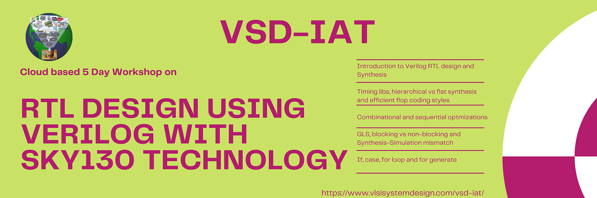

# RTL-design-synthesis-using-sky130--vsd

## Brief Intro To Course
This is a Five-Day workshop is  on RTL Design using verilog with SKY130 Technology which is organised by [VLSI System Design VSD](https://www.vlsisystemdesign.com/).Main agenda of this Five-Day workshop is on  Synthesis of verilog code into a predictable logic in silicon which is Gate-level netlist.As every verilog code can't be synthesizable and Even if does  it may result in different logic depending on the coding styles used.On Day-1 of the workshop I was introduced with Installation and Design verification using iverilog.And Basic Translation of Verilog code in Gate-Level netlist using Yosys.  
