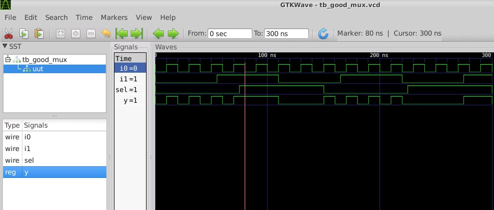

# RTL-Design with verilog using Sky130 Technology

## ***Brief Intro To Course***
This is a Five-Day workshop is  on RTL Design using verilog with SKY130 Technology which is organised by [VLSI System Design VSD](https://www.vlsisystemdesign.com/).Main agenda of this Five-Day workshop is on  Synthesis of verilog code into a predictable logic in silicon which is Gate-level netlist.As every verilog code can't be synthesizable and Even if does  it may result in different logic depending on the coding styles used.On Day-1 of the workshop I was introduced with Installation and Logical verification using iverilog.And Basic Translation of Verilog code in Gate-Level netlist using Yosys.  

# **TOOLS :**
-  Icarus Verilog: It is a verilog simulation and synthesis tool. It operates as a compiler, compiling source code written in Verilog (IEEE-1364) into some target format.Icarus Verilog is an open source Verilog compiler that supports the IEEE-1364 Verilog HDL including IEEE1364- 2005 plus.<br/>
-  GTKwave : GTKWave is a VCD waveform viewer based on the GTK library. This viewer support VCD and LXT formats for signal dumps. Which reads LXT, LXT2, VZT, FST, and GHW files as well as standard Verilog VCD/EVCD files and allows their viewing. <br/>
-  Yosys : Yosys is a framework for Verilog RTL synthesis. It currently has extensive Verilog-2005 support and provides a basic set of synthesis algorithms for various application domains. Technology used: Sky130 technology.<br/>.

  
# **INDEX**
- [RTL Design Synthesis using Sky130 Technology](https://github.com/Jayanth-sharma/RTL-design-synthesis-using-sky130--vsd#rtl-design-with-verilog-using-sky130-technology)<br/>
       - [Brief Intro To Course](https://github.com/Jayanth-sharma/RTL-design-synthesis-using-sky130--vsd#brief-intro-to-course)
   
- [Day1 :Introduction to Verilog RTL Design & Synthesis]()<br/>
       - [Introduction to Open-source Simulator iverilog]()<br/>
            - [Introduction to iverilog,Design and testbench]()<br/>
            - [Design iverilog and Testbench]()<br/>
            - [Iverilog Set-up and Simulation]()<br/>
	    - [ Simulation Using iverilog.]()<br/>
       - [Introduction to Yosys Open SYnthesis Suite]()<br/> 
          -   [Logic Synthesis of Mux using Yosys]() <br/>


# DAY1 : Introduction To Verilog RTL Design and Synthesis.

On the first day of the We preformed tool set-up.And analysed the basic flow of Simulator and Synthesiers.We also analysed the translated Gate-level netlist with Different Flavours of Standard cell types with  Constraints  of  mainly focusing  on Timing in Circuits  taking  Set-up and Hold-time into Consideration.And correlating the Performance of Cells with  wide width and narrow width to drive the Capacitors.And tried out Synthesis of a Good mux as well as Checked the Logical Funtionality in Iverilog and Gtkwave.<br/>

## Introduction to Open-source Simulator iverilog:


## Introduction to iverilog,Design and testbench

### Simulation:
- It is technique for applying different input stimulus to the design at different times to check if the RTL code behaves in an intended way.Usually using a Simulation Software(Simulator).In our case we are dealing with Digital design which is modelled using HDL (hardware description language) like VHDL,Verilog,System Verilog.And for high-level synthesis languages too such as C/C++,SystemC etc.
### Simulator:
- A Simulator is a tool which is used for checking a funtionality of Design.The simulator used here is "iverilog". <br />


### RTL Design :
-RTL design is the implementation of a specs.RTL design is checked  for adherence to the spec by the design.The tool used for Simulating the design is a Simulator.<br />
- Design is the actual verilog code or a set of verilog codes which has intented functionality to meet with the required specfication.<br/>
- RTL Design – Stands for Register Transfer Level. It provides an abstraction of the digital circuit using:<br/>
   -i.   Combinational logic<br/>
   -ii.  Registers<br/>
   -iii. Modules (IP’s or Soft Macros)<br/>

### Test-Bench:
- It is the Setup to apply stimulus(Test_Vectors) to Design to check it's Functionality.Here the Logical functionality is verified.

### How Simulator Works:
- Simulator continouly monitor for the changes on Inputs Signals
- Upon changes to input the Output is evaluated
     If there is no change in input,no change in output.
- Simulator dumps the change to the ouput to a file accoridng to the change in input.


## Design iverilog and Testbench
- The RTL design written in verilog code has some primary inputs and primary outputs. It may have one or more primary inputs and one or more corresponding primary       outputs.
- We need to give stimulus to all the primary inputs and need to observe the primary outputs. Thus we need stimulus generator at the input and stimulus observer at the   output.
- For giving stimulus we write the test bench, for that the design(module) is instantiated in the test bench, then stimulus is applied.
- It is important to note that the test bench doesn't have any primary input and primary output.
## iVerilog Designflow
- The iverilog file takes two inputs:
- RTL Design
- Test-Bench
- As Shown Below: 
       <p
	align="center">
    
    </p>
- The iverilog simulator dumps .vcd(value change dump) which can be viewed using gtkwave <br/>
- Here is a Blockdiagram representation of test-bench:
  <p align="">
    
</p>


## Iverilog Set-up and Simulation
- open terminal and create a root directory to work-in
- Here are the commands to Get started

  ```
   mkdir vlsi
   cd vlsi
   mkdir vsdflow
   git clone  https://github.com/kunalg123/sky130RTLDesignAndSynthesisWorkshop.git
   
   ```
- Now to Check the Content Enter

   ```
      cd vlsi
      cd vsdflow
      ls 
      cd sky130RTLDesignAndSynthesisWorkshop
      ls -ltr
      cd my_lib
      ls
      cd lib   :This file contain the  Sky130 Standard Cell library
      cd ..
      cd verilog_model :Content of verilog models
      
   ```
    <p align="center">
    
</p>
- Now check the Verilog files which contains the RTL and Test-Bench files 

   ```
      cd sky130RTLDesignAndSynthesisworkshop
      ls
      cd verilog_files
   ```
 <p align="center">
    
</p>

##  Simulation Using iverilog. <br/>
-  i.  RTL file and Test-bench files are passed with iverilog simulator.Intially  "a.out" file is outputed <br/>

```
iverilog good_mux.v tb_good_mux.v

```
-  ii. Now to get the .vcd file <br/>

```
./a.out

```
 <p align="center">
    
</p>
- iii.To view the waveform for logical verification run the .vcd file with gtkwave <br/>

``` 
 gtkwave tb_good_mux.vcd
 
 ```

<p align="center">
    
</p>

# Introduction to Yosys Open SYnthesis Suite.
- Yosys:
- This is a framework for RTL synthesis tools. It currently has extensive Verilog-2005 support and provides a basic set of synthesis algorithms for various  application domains.Which converts a RTL design to Gate-level Netlist.<br/>
- Here is a illustrative Example of How the Synthesis Maps the Gate-level-Netlist:
   <p align="center">
    
</p>

###  Flow of a Synthesizer:
  <p align="center">
    
</p>

###  .lib Function
> Why Diffrent Versions of Cells?
  <p align="center">
    
</p>
> Setup_time:
  <p align="center">
    
</p>


>Hold time:

<p align="center">
    
</p>
> Why Diffrent Versions of  Same Standard Cells?<br/>

###  Lets Do some Math:<br/>
 
 


- To maintain set-up Time In the Logic we need A Least Propagation Delay cells.As Propagation delay is least  Wide Width Transistor are preferred.<br/>
-  We Trade for Performance over higher Power,Area,Timing(In this Case).


- Similarly to Maintain Hold-Time delays We need Cells With Relatively More Progation Delay Cells.As Propagation delay is high Narrow Width Transistor are preferred. -  We Trade for Lower Power,Area,Timing(In this Case) over Performance. 
   That the Reason we are Having Bucket of Diffrent Standard Cells for The Same Logic.<br/>
  
  

## Logic Synthesis of Mux using Yosys:
   Here is A block-Diagram Representation of How The RTL Design Is Synthesized.
   
-  To invoke Yosys:
   ```
    cd verilog_files
    $ yosys
    
   ```
-  Yosys Synthesis Suite:
    
    
-  Reading sky130 standard library :
  ```
   $ read_liberty -lib ../my_lib/lib/sky130_fd_sc_hd__tt_025C_1v80.lib  
  
  ```
- read_liberty : It read cells from liberty file as modules into current design. The option "-lib" only create empty blackbox modules.
- 
- Now Synthesize the top level module : 
 ```
 $  synth -top good_mux
 
 ```
- Mapping to the standard library
    ```
  
  $  abc -liberty ../my_lib/lib/sky130_fd_sc_hd__tt_025C_1v80.lib

   ```
  
  Here is the Mapping.
- abc : This pass uses the ABC tool for technology mapping of yosys's internal gate library to a target architecture. This command converts RTL code into gates,cells   which is taken from the sky130_fd_sc_hd__tt_025C_1v80.lib file. 
- -liberty : It generate netlists for the specified cell library (using the liberty file format).
-  Its Re-integrates The Mapping:
-  
-  And Here are the Stats:
   

  
- To view the result as a grapviz use below command 
  ```
  $ show
  
  ```
  
- Write the netlist to a file :
  ```
  $ write_verilog -noattr good_mux_netlist.v
  
  ```
- Write verilog: 
- Syntax:When the command "write_verilog -rename_top <new_entity_name> <HDL_netlist>.v" is used, the Verilog file created does not rename the entity/module.
- -noattr-  By using this option no attributes are included in the output. good_mux_netlist.v : File name to which we want to write the netlist.
  <p align="center">
    
</p> 

- To view netlist:<br/>
    ```
     $ !gvim good_mux_netlist.v
    
    ```
 - good_mux netlist:<br/>
  ```
    /* Generated by Yosys 0.7 (git sha1 61f6811, gcc 6.2.0-11ubuntu1 -O2 -fdebug-prefix-map=/build/yosys-OIL3SR/yosys-0.7=. -fstack-protector-strong -fPIC -Os) */

  module good_mux(i0, i1, sel, y);
  wire _0_;
  wire _1_;
  wire _2_;
  wire _3_;
  wire _4_;
  wire _5_;
  input i0;
  input i1;
  input sel;
  output y;
  sky130_fd_sc_hd__clkinv_1 _6_ (
    .A(_0_),
    .Y(_4_)
  );
  sky130_fd_sc_hd__nand2_1 _7_ (
    .A(_1_),
    .B(_2_),
    .Y(_5_)
  );
  sky130_fd_sc_hd__o21ai_0 _8_ (
    .A1(_2_),
    .A2(_4_),
    .B1(_5_),
    .Y(_3_)
  );
  assign _0_ = i0;
  assign _1_ = i1;
  assign _2_ = sel;
  assign y = _3_;
 endmodule  
 
 ```   
   
 


# Day2: Timming lib,Hierarchical vs Flat Synthesis and Efficient Flop Coding Styles 

# Introduction to Timing.lib
- The Standard cell library :
- The Library files We are Using Here are Sky130 Process Node:
- About Sky130 Process Node:The SKY130 is a mature 180nm-130nm hybrid technology originally developed internally by Cypress Semiconductor before being spun out into     SkyWater Technology and made accessible to general industry.  
 
    ```
    
    $  gvim Sky130_fd_scSky130_fd_sc_hd_tt_025C_1v80.lib  
 
   ```

 

#  Nomenclature of Standard Cell Library. 
  <p align="center">
    
</p> 
 Default Technology Process:
   <p align="center">
    
</p>
 
 Defaults PVT corners:
  <p align="center">
    
</p>

- To search individual  Standard cells in library use the following Commands.

```

:syn off     //to turn off the syntax
:se nu     //To show numbers
:/cell     //search for "cell"
:g//       //list all

```
here is a Info on A cell:
 <p align="center">
    
</p>

- Here is a small comparsion of a typical  standard cell
  <p align="center">
    
</p>

# Hierarchical vs flat:
## Hierarchical Synthesis With Multiple Modules:

### synth -top 

- Here is an Verilog Code to Check Synthesis of Multiple Modules.

 ```

 module sub_module2 (input a, input b, output y);
	assign y = a | b;
 endmodule

 module sub_module1 (input a, input b, output y);
	assign y = a&b;
 endmodule


 module multiple_modules (input a, input b, input c , output y);
	wire net1;
	sub_module1 u1(.a(a),.b(b),.y(net1));  
	sub_module2 u2(.a(net1),.b(c),.y(y));  
 endmodule

 ```
- Now Lets Synthesize:
 
  
  ```
 
  4.25. Printing statistics.

  === multiple_modules ===

   Number of wires:                  5
   Number of wire bits:              5
   Number of public wires:           5
   Number of public wire bits:       5
   Number of memories:               0
   Number of memory bits:            0
   Number of processes:              0
   Number of cells:                  2
     sub_module1                     1
     sub_module2                     1

  === sub_module1 ===

   Number of wires:                  3
   Number of wire bits:              3
   Number of public wires:           3
   Number of public wire bits:       3
   Number of memories:               0
   Number of memory bits:            0
   Number of processes:              0
   Number of cells:                  1
     $_AND_                          1

  === sub_module2 ===

   Number of wires:                  3
   Number of wire bits:              3
   Number of public wires:           3
   Number of public wire bits:       3
   Number of memories:               0
   Number of memory bits:            0
   Number of processes:              0
   Number of cells:                  1
     $_OR_                           1

  === design hierarchy ===

   multiple_modules                  1
     sub_module1                     1
     sub_module2                     1

   Number of wires:                 11
   Number of wire bits:             11
   Number of public wires:          11
   Number of public wire bits:      11
   Number of memories:               0
   Number of memory bits:            0
   Number of processes:              0
   Number of cells:                  2
     $_AND_                          1
     $_OR_                           1
  
  ```
  
  
  ## Netlist of Multiple Models With hierarchical synthesis :
  
  ```

   /* Generated by Yosys 0.7 (git sha1 61f6811, gcc 6.2.0-11ubuntu1 -O2 -fdebug-prefix-map=/build/yosys-OIL3SR/yosys-0.7=. -fstack-protector-strong -fPIC -Os) */
  
  module multiple_modules(a, b, c, y);
  input a;
  input b;
  input c;
  wire net1;
  output y;
  sub_module1 u1 (
    .a(a),
    .b(b),
    .y(net1)
  );
  sub_module2 u2 (
    .a(net1),
    .b(c),
    .y(y)
  );
  endmodule

  module sub_module1(a, b, y);
  wire _0_;
  wire _1_;
  wire _2_;
  input a;
  input b;
  output y;
  sky130_fd_sc_hd__and2_2 _3_ (
    .A(_0_),
    .B(_1_),
    .X(_2_)
   );
   assign _0_ = b;
   assign _1_ = a;
   assign y = _2_;
   endmodule

   module sub_module2(a, b, y);
   wire _0_;
   wire _1_;
   wire _2_;
   wire _3_;
   wire _4_;
   input a;
   input b;
   output y;
   sky130_fd_sc_hd__clkinv_1 _5_ (
    .A(_0_),
    .Y(_3_)
   );
   sky130_fd_sc_hd__clkinv_1 _6_ (
    .A(_1_),
    .Y(_4_)
   );
   sky130_fd_sc_hd__nand2_1 _7_ (
    .A(_3_),
    .B(_4_),
    .Y(_2_)
   );
   assign _0_ = b;
   assign _1_ = a;
   assign y = _2_;
   endmodule
  

  ``` 
  <p align="center">
    
</p>
 

### Excercise with .lib


# Flatten Synthesis:
- Flatten- 


## Sub-Module Level Synthesis:
- Synth -top Sub_module1:
 <p align="center">
    
</p>
  
- With Sub-Module1 :
<p align="center">
    
</p>
- Cell integrated In Sub_module 1:
 <p align="center">
    
</p>
- And Here is the View:
  <p align="center">
    
</p>

 ```
 /* Generated by Yosys 0.9+4081 (git sha1 862e84eb, gcc 7.5.0-3ubuntu1~18.04 -fPIC -Os) */

(* top =  1  *)
(* src = "multiple_modules.v:10.1-14.10" *)
module multiple_modules(a, b, c, y);
  (* src = "multiple_modules.v:12.14-12.38|multiple_modules.v:5.27-5.28" *)
  wire _0_;
  (* src = "multiple_modules.v:12.14-12.38|multiple_modules.v:5.36-5.37" *)
  wire _1_;
  (* src = "multiple_modules.v:12.14-12.38|multiple_modules.v:5.46-5.47" *)
  wire _2_;
  (* src = "multiple_modules.v:13.14-13.38|multiple_modules.v:1.27-1.28" *)
  wire _3_;
  (* src = "multiple_modules.v:13.14-13.38|multiple_modules.v:1.36-1.37" *)
  wire _4_;
  (* src = "multiple_modules.v:13.14-13.38|multiple_modules.v:1.46-1.47" *)
  wire _5_;
  (* src = "multiple_modules.v:10.32-10.33" *)
  input a;
  (* src = "multiple_modules.v:10.41-10.42" *)
  input b;
  (* src = "multiple_modules.v:10.50-10.51" *)
  input c;
  (* src = "multiple_modules.v:11.7-11.11" *)
  wire net1;
  (* hdlname = "u1 a" *)
  (* src = "multiple_modules.v:12.14-12.38|multiple_modules.v:5.27-5.28" *)
  wire \u1.a ;
  (* hdlname = "u1 b" *)
  (* src = "multiple_modules.v:12.14-12.38|multiple_modules.v:5.36-5.37" *)
  wire \u1.b ;
  (* hdlname = "u1 y" *)
  (* src = "multiple_modules.v:12.14-12.38|multiple_modules.v:5.46-5.47" *)
  wire \u1.y ;
  (* hdlname = "u2 a" *)
  (* src = "multiple_modules.v:13.14-13.38|multiple_modules.v:1.27-1.28" *)
  wire \u2.a ;
  (* hdlname = "u2 b" *)
  (* src = "multiple_modules.v:13.14-13.38|multiple_modules.v:1.36-1.37" *)
  wire \u2.b ;
  (* hdlname = "u2 y" *)
  (* src = "multiple_modules.v:13.14-13.38|multiple_modules.v:1.46-1.47" *)
  wire \u2.y ;
  (* src = "multiple_modules.v:10.61-10.62" *)
  output y;
  sky130_fd_sc_hd__and2_0 _6_ (
    .A(_1_),
    .B(_0_),
    .X(_2_)
  );
  sky130_fd_sc_hd__lpflow_inputiso1p_1 _7_ (
    .A(_4_),
    .SLEEP(_3_),
    .X(_5_)
  );
  assign _4_ = \u2.b ;
  assign _3_ = \u2.a ;
  assign \u2.y  = _5_;
  assign \u2.a  = net1;
  assign \u2.b  = c;
  assign y = \u2.y ;
  assign _1_ = \u1.b ;
  assign _0_ = \u1.a ;
  assign \u1.y  = _2_;
  assign \u1.a  = a;
  assign \u1.b  = b;
  assign net1 = \u1.y ;
endmodule

 
 ```


<p align="center">
    
</p>

## Sub-Module use-Cases:
   
  
  
# Flop Coding Styles and Optimisations:
- Simulation of flops:
- Asynchronous Reset:
<p align="center">
    
</p>
- Asynchronous Set:
 <p align="center">
    
</p>
- Synchronous Reset: 
  <p align="center">
    
</p>
- Synchronous Set:
   <p align="center">
    
</p>
## Synthesis of Flops:
- Here are the files to synthesis:
-  <p align="center">
    
</p>
 ```
  $ dfflibmap -liberty ../my_lib/lib/sky130_fd_sc_hd__tt_025C_1v80.v
 
 ```
- Asynchronous Reset:
  <p align="center">
    
</p>
- Synchronous Reset:
   <p align="center">
    
</p>

 
## Optimisation:
 
  <p align="center">
    
</p>
   <p align="center">
    
</p>
- Why no Cell incured:
  
   

- Netlist Mul2:
  
  ```
  write_verilog mult_2.v  :dumps mul2
  !gvim mul2
  
  ```
  ```
  
  /* Generated by Yosys 0.9+4081 (git sha1 862e84eb, gcc 7.5.0-3ubuntu1~18.04 -fPIC -Os) */

  (* top =  1  *)
  (* src = "mult_2.v:1.1-3.10" *)
  module mul2(a, y);
  (* src = "mult_2.v:1.26-1.27" *)
  input [2:0] a;
  (* src = "mult_2.v:1.42-1.43" *)
  output [3:0] y;
   assign y = { a, 1'h0 };
   endmodule

  ```
  ```
  /* Generated by Yosys 0.7 (git sha1 61f6811, gcc 6.2.0-11ubuntu1 -O2 -fdebug-prefix-map=/build/yosys-OIL3SR/yosys-0.7=. -fstack-protector-strong -fPIC -Os) */

  module mul2(a, y);
  input [2:0] a;
  output [3:0] y;
  assign y = { a, 1'b0 };
  endmodule

  ```
  
  <p align="center">
    
</p>
   <p align="center">
    
</p>
  
 - Mult8 
   ```
   /* Generated by Yosys 0.9+4081 (git sha1 862e84eb, gcc 7.5.0-3ubuntu1~18.04 -fPIC -Os) */

   (* top =  1  *)
   (* src = "mult_2.v:1.1-3.10" *)
   module mul2(a, y);
   (* src = "mult_2.v:1.26-1.27" *)
   input [2:0] a;
   (* src = "mult_2.v:1.42-1.43" *)
   output [3:0] y;
   assign y = { a, 1'h0 };
   endmodule

   ```
  
   ```
   /* Generated by Yosys 0.9+4081 (git sha1 862e84eb, gcc 7.5.0-3ubuntu1~18.04 -fPIC -Os) */

   module mult8(a, y);
     input [2:0] a;
     output [5:0] y;
     assign y = { a, a }; 
   endmodule
  
   ```
   
# Day 3:Combinational And Synthesis Optimisation:
## Intro To  Optimisation:
## Combinational  Logic Optimisation : 
 -  opt_check.v
 
    ```
    module opt_check (input a , input b , output y);
	assign y = a?b:0;
    endmodule 
      ```
- Here is the Circuit without optimisation:
  
    <p align="center">
    
  </p>
    
      
 - The following command Removes the unused Wires:
    
    ``` 
    opt_clean -purge
    
    ```
  
    
##  Excerise:
-  opt_check4:

### Multiple_modules_opt In Hier Vs flat:
-  UnderExcerise
   Here are the verilog_files associated with Mutliple Modules for Optimisation:
   
    
-  Verilog Code For Multiptle_modules_opt:
- 
   ```
   module sub_module1(input a , input b , output y);
   assign y = a & b;
   endmodule


   module sub_module2(input a , input b , output y);
   assign y = a^b;
   endmodule


   module multiple_module_opt(input a , input b , input c , input d , output y);
   wire n1,n2,n3;

   sub_module1 U1 (.a(a) , .b(1'b1) , .y(n1));
      sub_module2 U2 (.a(n1), .b(1'b0) , .y(n2));
      sub_module2 U3 (.a(b), .b(d) , .y(n3));

     assign y = c | (b & n1); 


     endmodule
     
   ```
   Synthesis Report:
   
   ```
   3.25. Printing statistics.

    === sub_module1 ===

    Number of wires:                  3
    Number of wire bits:              3
    Number of public wires:           3
    Number of public wire bits:       3
    Number of memories:               0
    Number of memory bits:            0
    Number of processes:              0
    Number of cells:                  1
      $_AND_                          1

    === multiple_module_opt ===

    Number of wires:                  7
    Number of wire bits:              7
    Number of public wires:           6
    Number of public wire bits:       6
    Number of memories:               0
    Number of memory bits:            0
    Number of processes:              0
    Number of cells:                  3
      $_AND_                          1
      $_OR_                           1
      sub_module1                     1
 
    === design hierarchy ===

    multiple_module_opt               1
      sub_module1                     1

    Number of wires:                 10
    Number of wire bits:             10
    Number of public wires:           9
    Number of public wire bits:       9
    Number of memories:               0
    Number of memory bits:            0
    Number of processes:              0
    Number of cells:                  3
      $_AND_                          2
      $_OR_                           1

   ```
-  With opt_clean -purge vs without:
   With Clean:
   
    
   Without clean:
   
- Multiple_module_opt2 hier vs Flatten:
- Similarly Hier with Multiple_module_opt2
  
  
- Flatten multiple_module_opt2:
    <p align="center">
    
  </p>
  <p align="center">
    
 </p>
   

## Seqential Logic Optimisation:
## Sequential Optimisation
- dff_const1.v 
  ```
  module dff_const1(input clk, input reset, output reg q);   
   always @(posedge clk, posedge reset) 
   begin
	if(reset)
		q <= 1'b0;
	else
		q <= 1'b1;
    end

    endmodule
   //td_dff_const1
    UPLOAD
    
  ```
### Optimisation On Yosys:
-  For optimisation:
-  Don't  forgot to add 
   ```
   dfflibmap  ./my_lib/lib/sky130_fd_sc_hd__tt_025C_1v80.lib  
      ```
   
   dff_const4.v
   ```
   module dff_const4(input clk, input reset, output reg q);
    reg q1;

    always @(posedge clk, posedge reset)
    begin
	if(reset)
	begin
		q <= 1'b1;
		q1 <= 1'b1;
	end
	  else
	     begin
		q1 <= 1'b1;
		q <= q1;
	   end
          end

     endmodule
     
   ```
   dff_const5.v
```module dff_const5(input clk, input reset, output reg q);
reg q1;

always @(posedge clk, posedge reset)
begin
	if(reset)
	begin
		q <= 1'b0;
		q1 <= 1'b0;
	end
	else
	begin
		q1 <= 1'b1;
		q <= q1;
	end
end

endmodule
```
## Seqential Logic Optimisation For Used Inputs:


### Experiment:
- Now Let's assign count(q) of the counter as follows:

#  Day 4:GLS,Blocking Vs Non-Blocking and Synthesis Mismatch:
## Gate-Level-Simulation Concepts Flow Using Iverilog:

   

### Gate Level Simulation:
-  In GLS the Synthesized netlist is Simulated to Verify  the  logical correctness of the Design.Running the Test bench with Design Under Test.
-  Netlist is logically same as RTL programme  except the representation of design is more Technology centric to pass the design lower abstraction layer with      neccessary  optimisations done with Available Standard Cells,PVT(eco) corners.By keeping Set of input and Output the same of RTL abstractions. 
    -  Same Test Bench can be Used 
-   Also Ensuring timing of design is met.For which GLS needs a be run with Design Annotation.
-   
## GLS Synthesis Simulation Mismatch:
- Simulator works with the concept of activity.
- Missing Sensitivity List
   ```
    module ternary_operator_mux (input i0 , input i1 , input sel , output y);
	assign y = sel?i1:i0;
	endmodule
   ```
   ```
   module bad_mux (input i0 , input i1 , input sel , output reg y);
   always @ (sel)
   begin
	if(sel)
		y <= i1;
	else 
		y <= i0;
    end
   endmodule
   ```
   ```module good_mux (input i0 , input i1 , input sel , output reg y);
      always @ (*)
      begin
	if(sel)
		y <= i1;
	else 
		y <= i0;
        end
      endmodule
   ```
  
 

## Blocking And Non-Blocking Statements:
  ```
   module blocking_caveat (input a , input b , input  c, output reg d); 
   reg x;     
   always @ (*)
   begin
	d = x & c;
	x = a | b;
   end   
   endmodule

 ```
 # Day 5: If,Case,For loop and For Generate:
 ## Incomplete IF:
    ```
    module incomp_if (input i0 , input i1 , input i2 , output reg y);
    always @ (*)  
    begin
	if(i0)
		y <= i1;
    end   
    endmodule
    ```
 - InComplete if2:   
   
    ```
        module incomp_if2 (input i0 , input i1 , input i2 , input i3, output reg y);
        always @ (*)
       begin
	if(i0)
		y <= i1;
	else if (i2)
		y <= i3;

      end
       endmodule
     ```
-  Incomplete Case :
   ```
   module incomp_case (input i0 , input i1 , input i2 , input [1:0] sel, output reg y);
   always @ (*)
   begin
	case(sel)
		2'b00 : y = i0;
		2'b01 : y = i1;
	endcase
   end
   endmodule
   ``` 
- Complete Case:
  ```module comp_case (input i0 , input i1 , input i2 , input [1:0] sel, output reg y);
    always @ (*)
     begin
	case(sel)
		2'b00 : y = i0;
		2'b01 : y = i1;
		default : y = i2;
	endcase
     end
     endmodule
  
  ```
-  Partial latch Assignments:<br/>

        ```
         module partial_case_assign (input i0 , input i1 , input i2 , input [1:0] sel, output reg y , output reg x);    
         always @ (*)
         begin
	    case(sel)
		2'b00 : begin
			y = i0;
			x = i2;
			end
		2'b01 : y = i1;
		default : begin
		           x = i1;
			   y = i2;
			  end
	    endcase
            end
          endmodule
	 
       ```
- Bad Case:
  
  ```
    module bad_case (input i0 , input i1, input i2, input i3 , input [1:0] sel, output reg y);
    always @(*)
    begin
	case(sel)
		2'b00: y = i0;
		2'b01: y = i1;
		2'b10: y = i2;
		2'b1?: y = i3;
		//2'b11: y = i3;
	endcase
       end

     endmodule
  ```
-   After Changes in Case:    
    ```
    module bad_case (input i0 , input i1, input i2, input i3 , input [1:0] sel, output reg y);
    always @(*)
    begin
	case(sel)
		2'b00: y = i0;
		2'b01: y = i1;
		2'b10: y = i2;
		2'b11: y = i3;
		//2'b11: y = i3;
	endcase
     end

    endmodule

    ```
    
## For and Generate
- mux generate:  
   ```
   module mux_generate (input i0 , input i1, input i2 , input i3 , input [1:0] sel  , output reg y);
   wire [3:0] i_int;
   assign i_int = {i3,i2,i1,i0};
   integer k;
   always @ (*)
   begin
   for(k = 0; k < 4; k=k+1) begin
	if(k == sel)
		y = i_int[k];
   end
   end
  endmodule

   ```
-  demux: <br/>
-  Demux using Case. 
  ```
  
  ```
  ```
  module demux_generate (output o0 , output o1, output o2 , output o3, output o4, output o5, output o6 , output o7 , input [2:0] sel  , input i);
reg [7:0]y_int;
assign {o7,o6,o5,o4,o3,o2,o1,o0} = y_int;
integer k;
always @ (*)
begin
y_int = 8'b0;
for(k = 0; k < 8; k++) begin
	if(k == sel)
		y_int[k] = i;
end
end
endmodule


  ```
  
  ```/* Generated by Yosys 0.9+4081 (git sha1 862e84eb, gcc 7.5.0-3ubuntu1~18.04 -fPIC -Os) */

module demux_case(o0, o1, o2, o3, o4, o5, o6, o7, sel, i);
  wire _00_;
  wire _01_;
  wire _02_;
  wire _03_;
  wire _04_;
  wire _05_;
  wire _06_;
  wire _07_;
  wire _08_;
  wire _09_;
  wire _10_;
  wire _11_;
  wire _12_;
  wire _13_;
  wire _14_;
  wire _15_;
  wire _16_;
  wire _17_;
  wire _18_;
  wire _19_;
  wire _20_;
  wire _21_;
  wire _22_;
  wire _23_;
  wire _24_;
  wire _25_;
  wire _26_;
  wire _27_;
  wire _28_;
  wire _29_;
  wire _30_;
  wire _31_;
  wire _32_;
  wire _33_;
  wire _34_;
  wire _35_;
  wire _36_;
  wire _37_;
  wire _38_;
  wire _39_;
  wire _40_;
  wire _41_;
  wire _42_;
  wire _43_;
  wire _44_;
  wire _45_;
  input i;
  output o0;
  output o1;
  output o2;
  output o3;
  output o4;
  output o5;
  output o6;
  output o7;
  input [2:0] sel;
  wire [7:0] y_int;
  sky130_fd_sc_hd__and4b_1 _46_ (
    .A_N(_44_),
    .B(_43_),
    .C(_34_),
    .D(_45_),
    .X(_40_)
  );
  sky130_fd_sc_hd__nor4bb_1 _47_ (
    .A(_45_),
    .B(_44_),
    .C_N(_43_),
    .D_N(_34_),
    .Y(_36_)
  );
  sky130_fd_sc_hd__and4b_1 _48_ (
    .A_N(_45_),
    .B(_44_),
    .C(_43_),
    .D(_34_),
    .X(_38_)
  );
  sky130_fd_sc_hd__nor4bb_1 _49_ (
    .A(_45_),
    .B(_43_),
    .C_N(_34_),
    .D_N(_44_),
    .Y(_37_)
  );
  sky130_fd_sc_hd__and4b_1 _50_ (
    .A_N(_43_),
    .B(_34_),
    .C(_45_),
    .D(_44_),
    .X(_41_)
  );
  sky130_fd_sc_hd__nor4b_1 _51_ (
    .A(_45_),
    .B(_44_),
    .C(_43_),
    .D_N(_34_),
    .Y(_35_)
  );
  sky130_fd_sc_hd__nor4bb_1 _52_ (
    .A(_44_),
    .B(_43_),
    .C_N(_34_),
    .D_N(_45_),
    .Y(_39_)
  );
  sky130_fd_sc_hd__and4_1 _53_ (
    .A(_45_),
    .B(_44_),
    .C(_43_),
    .D(_34_),
    .X(_42_)
  );
  assign y_int = { o7, o6, o5, o4, o3, o2, o1, o0 };
  assign _45_ = sel[2];
  assign _44_ = sel[1];
  assign _43_ = sel[0];
  assign _34_ = i;
  assign o5 = _40_;
  assign o1 = _36_;
  assign o3 = _38_;
  assign o2 = _37_;
  assign o6 = _41_;
  assign o0 = _35_;
  assign o4 = _39_;
  assign o7 = _42_;
endmodule
  ```
# Generate :

- Ripple carry adder:
  ```
  module rca (input [7:0] num1 , input [7:0] num2 , output [8:0] sum);
  wire [7:0] int_sum;
  wire [7:0]int_co;

   genvar i;
    generate
	for (i = 1 ; i < 8; i=i+1) begin
		fa u_fa_1 (.a(num1[i]),.b(num2[i]),.c(int_co[i-1]),.co(int_co[i]),.sum(int_sum[i]));
	end

   endgenerate
   fa u_fa_0 (.a(num1[0]),.b(num2[0]),.c(1'b0),.co(int_co[0]),.sum(int_sum[0]));


   assign sum[7:0] = int_sum;
   assign sum[8] = int_co[7];
   endmodule

  ```
  Verilog Program for Full Adder Instantiation:
  ```
  module fa (input a , input b , input c, output co , output sum);
	assign {co,sum}  = a + b + c ;
   endmodule
  ```
# Acknowledgements:
- [Kunalghosh(Co-founder-VLSI System Design)](https://github.com/kunalg123)
- [Shon Taware (Teaching Assistant)](https://github.com/ShonTaware)
 


